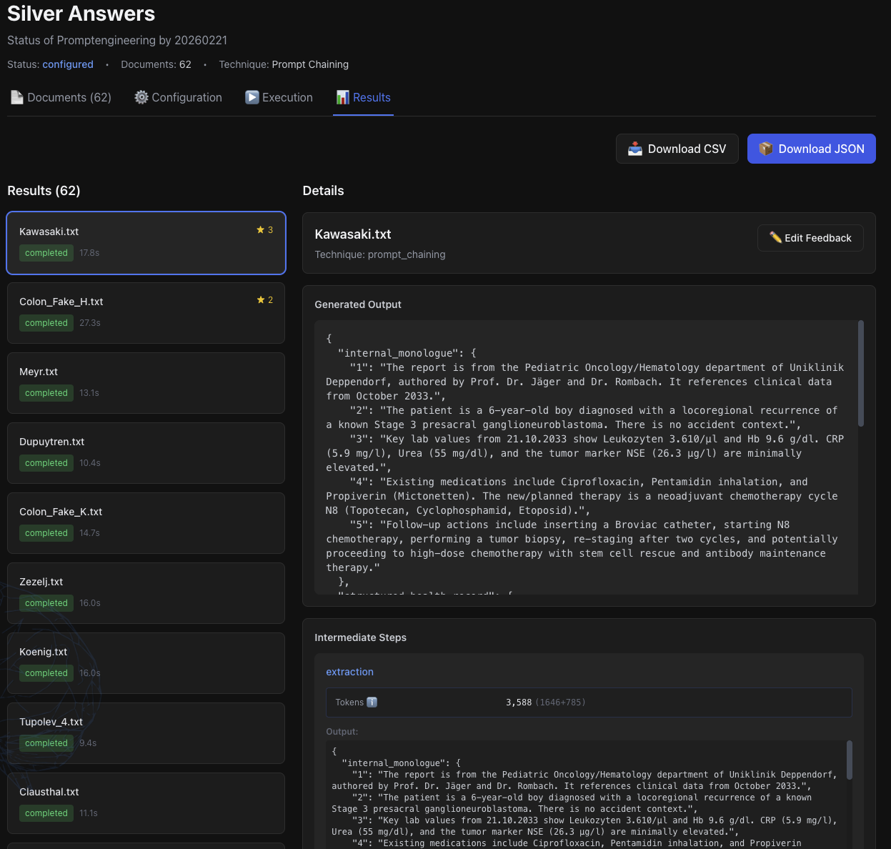

# Methodology {#sec:methodology}

**Development of an Algorithmic Framework for Resource-Efficient Local LLM Selection**

The primary objective of this study is the development of an algorithmic selection framework designed to identify the most resource-efficient Large Language Model (LLM) suitable for local execution. By validating output quality against a set of verified "Golden Answers", this research seeks to establish an optimal equilibrium between computational performance and data sovereignty. The proposed algorithm argues for a shift away from maximalist parameter counts towards targeted efficiency without compromising output fidelity.

The theoretical foundations established in Chapter \ref{sec:related-work} directly dictate the structure of this methodology. Local Small Language Models (SLMs) face hard architectural limits as described by the scaling laws and the Densing Law in Section \ref{sec:scaling-laws}: beyond a certain parameter threshold, gains in capability density plateau, making larger models unnecessary for well-scoped tasks. At the same time, Section \ref{sec:context-engineering} demonstrates that Chain-of-Thought (CoT) prompting provides the traceability needed for scientific validation of medical extraction outputs. These two constraints together make a CoT-based Silver Answer generation via a large, capable model in Phase I a methodological necessity — against which the smaller SLMs are then evaluated in a Zero-Shot setting in Phase III.

## Procedure

{#fig:methodology-overview}

The research design follows a rigorous four-phase methodological approach to ensure reproducibility and statistical significance:

### Phase I: Dataset Curation and Establishment of Ground Truth
The 62 clinical reports from the GraSCCo corpus are selected, categorised by medical specialty, and preprocessed into a standardised input format. The researchers define the target extraction schema (a structured JSON record with six clinical fields) in collaboration with a General Practitioner (GP). This schema serves as the immutable benchmark structure for all subsequent phases.

### Phase II: Automated Generation and Supervised Validation of Reference Solutions
Using the *Silver Answers App*, a SOTA model (Gemini 2.5 Pro) generates structured extractions for all 62 documents via Chain-of-Thought prompting. The GP reviews a subset of these outputs, correcting hallucinations and omissions to produce validated reference answers. The prompt engineering sessions are logged to enable comparison of prompting strategies across model sizes in Phase III.

### Phase III: Technical Implementation of the Multi-Model Evaluation Pipeline
This pipeline is implemented as *llm-validator*, a purpose-built evaluation framework described in Section \ref{sec:eval-metrics}. The framework executes each of the 11 candidate models against all 62 test cases in a Zero-Shot configuration. Each model receives the identical system prompt and clinical input. The framework captures eight evaluation metrics per interaction — five statistical, one embedding-based, and two LLM-as-a-Judge — producing the empirical dataset for analysis.

### Phase IV: Statistical Analysis and Optimal Model Identification
The evaluation data is aggregated into composite scores per model, combining statistical, embedding-based, and LLM-as-a-Judge metrics. Cross-metric correlation analysis identifies which metrics capture independent quality dimensions. The results are interpreted against the research questions to determine the minimum viable model size for clinical deployment.

**Self-Built Components.** Three purpose-built tools were developed to implement this pipeline: (1) The *Silver Answers App* (Node.js/React, cloud-based) facilitates Phase I–II by generating and annotating reference answers via Gemini 2.5 Pro (Section \ref{sec:experimental-setup}). (2) The *llm-validator* (Java 21/Quarkus, locally deployed) implements the evaluation pipeline for Phase III–IV, orchestrating batch execution across multiple models and applying both statistical and LLM-as-a-Judge metrics (Section \ref{sec:json-sim}). (3) Two *custom evaluation metrics* — JSON Structural Similarity and the DAG-based medical extraction quality metric — were developed specifically for this study to capture structured extraction quality that standard NLP metrics cannot assess (Sections \ref{sec:json-sim}–\ref{sec:dag-metric}). No existing evaluation framework (e.g. RAGAS, DeepEval) was used; the entire pipeline was implemented from scratch to ensure full control over the evaluation process and compatibility with both cloud and local LLM providers.

## Data Source: GraSCCo

Instead of generic document types, this research utilizes the **Graz Synthetic Clinical text Corpus (GraSCCo)** [@GraSCCo_PII_V2_2025; @modersohn2022grascco]. 

GraSCCo is the first publicly shareable, multiply-alienated German clinical text corpus, designed specifically for clinical NLP tasks without compromising 
patient privacy.

The corpus provides a diverse set of clinical scenarios, which we use to evaluate the models' ability to classify document intent and generate appropriate 
clinical actions based on German-language clinical reports.

The task we give the models is to update a patients health record (HBA) based on supplied clinical report. [Appendix: Gold Standard Example](#appendix-gold-standard) shows a representative GraSCCo clinical report alongside its CoT-extracted structured output.

## Golden Answer Generation

This study distinguishes two tiers of reference answers:

- **Silver Answer:** A structured JSON extraction generated by a SOTA LLM (Gemini 2.5 Pro) using Chain-of-Thought prompting. Silver Answers are produced automatically for all 62 documents and serve as the primary evaluation benchmark.
- **Golden Answer:** A Silver Answer that has been reviewed and corrected by a medical expert (GP). Golden Answers represent the validated ground truth but are available only for a subset of documents due to expert time constraints.

The use of Silver Answers as the primary benchmark is a pragmatic decision: manually authoring 62 structured extractions with the required JSON schema would demand significant expert time and would itself introduce annotator variability. The validity of this approach is discussed in Chapter \ref{sec:discussion}.

### Preparation Work

The following preparatory steps were undertaken in collaboration with a General Practitioner to define the extraction target and ensure clinical relevance of the output format.

#### Medical Context Stratification

The reports from the **GraSCCo** corpus were categorized into specific medical fields. This stratification allows for a granular comparison of model performance across different clinical contexts and enables an evaluation of the models' ability to correctly assign documents to their respective domains.

The following categories were defined for this study:

* Oncology
* Neurology
* Psychiatry
* Cardiology
* Internal Medicine
* Surgery
* Orthopedics
* Ophthalmology
* Dermatology

#### Standardized Output Format

In collaboration with a **General Practitioner (GP)**, a simplified output format was developed. This structure serves as the template for the prompt's output, allowing for the isolated evaluation of partial results and specific data extraction capabilities.

The standardized format consists of the following six sections:

1. **Categories:** One or more precise categories from the predefined list above.
2. **Date and Source:** The date of the report and the issuing entity (e.g., institute, clinic, or specific physician).
3. **Diagnosis:** The specific diagnosis as documented by the author of the original report.
4. **Relevant Metrics:** Extraction of laboratory values, measurement data (e.g., blood pressure, BMI), and other clinical parameters.
5. **Current or Advised Medications:** A list of medications, specifically distinguishing between the patient’s **current** medication and **recommended/prescribed** new treatments.
6. **Follow-up:** Extraction of the next clinical steps or planned interventions mentioned in the report.

#### Prompt Constraints and Data Integrity

To minimize "hallucinations" and ensure clinical reliability, the prompt instructions include strict constraints:

* **Evidence-Based Extraction:** The model is instructed to only output values if there is a clear and unambiguous reference within the source text.
* **Linguistic Consistency:** The output must be generated in the **original language** of the document (German) to maintain technical accuracy and prevent translation errors during the extraction phase.

### Selection of Prompting Technique: Chain-of-Thought (CoT)

To generate these Silver Answers, we have selected Chain-of-Thought (CoT) prompting. Based on the Comprehensive Comparison of Prompting Techniques, CoT was chosen over other methods for the following strategic reasons:
* Clinical Reasoning Alignment: CoT instructs the model to generate intermediate reasoning steps. In a medical context, this is critical for connecting implied symptoms to explicit medical codes and prevents the model from "skipping" vital clinical details.
* Improved Traceability: By breaking down the task—for example, listing medications first, then checking their historical status, and finally formatting the output—the model's reasoning becomes auditable, making unsupported extractions detectable during expert review.
* Structural Integrity: Unlike simpler techniques, CoT allows for the separation of the "thought" process from the final "golden answer," ensuring

[See: Comprehensive Comparison of Prompting Techniques](#appendix-promp-techs)

While techniques like Self-Consistency or Multi-Persona Prompting offer higher reliability, they were deemed less efficient for this stage due to significantly higher complexity, computational costs and latency. CoT provides the optimal balance between reasoning depth and token efficiency for clinical document classification.

| **Feature** | **Standard Prompt** | **Chain of Thought Prompt** |
|-------------|---------------------|-----------------------------|
| **Processing Style**	| Pattern matching & Direct Extraction	| Logical deduction & Evidence-first |
| **Accuracy** | High for simple reports | Superior for complex, conflicting reports |
| **Traceability** | Low (only the result is visible) | High (reasoning exposes evidence gaps) |
| **Token Usage** | Low (Cost-efficient) | Higher (More verbose output) |
| **Auditability** | Difficult (Only the result is visible) | Transparent (You see why it chose a category) |

### System Prompt: Clinical Data Extraction (CoT)

The system prompt is formulated in English while input documents are German. This pragmatic choice reflects the English-centric training data of most instruction-tuned models, though recent research suggests that the advantage of English-language prompts over native-language prompts is task-dependent rather than universal [@huang2025multilingualprompt]. The output schema constrains extracted medical content to the source language (German), ensuring clinical accuracy. In a Swiss deployment context, this separation of instruction language and content language is additionally practical, as clinical reports may arrive in German, French, or Italian. It should be noted that the model selection (Section \ref{sec:experimental-setup}) did not specifically account for whether individual models were trained on multilingual corpora — a factor that may influence extraction quality for non english clinical texts.

In a medical context, the CoT structure is particularly valuable because it forces the LLM to identify the evidence in the text before committing to a category or a medication status. This reduces "lazy" extractions where a model might miss a nuance (like a medication being discontinued).

**Used prompt:**

```text
Role: You are an expert Medical Registrar. Extract data into a structured
JSON format.

Constraints:
1. Factuality: Extract information ONLY if explicitly stated. 
2. Language: Content values must be in the original document language (German).
3. Format: Output ONLY a single valid JSON object.

Available Categories: You MUST choose one or more from this specific list: 
["Onkologie", "Neurologie", "Psychiatrie", "Kardiologie", "Innere Medizin",
 "Chirurgie", "Orthopädie", "Ophthalmologie", "Dermatologie"]

Methodology: Use the "internal_monologue" to analyze the text step-by-step
before populating the final fields.

Output Schema:
{
 "internal_monologue": {
  "1": "Identify the documents creation date and author or institutions",
  "2": "List diagnoses and primary reason",
  "3": "Locate numerical metrics",
  "4": "Distinguish current vs. advised medication",
  "5": "Identify follow-up instructions"
 },
 "structured_health_record": {
  "categories": ["Must be from the list above"],
  "date_and_source": "YYYY-MM-DD; Institution/Doctor",
  "diagnosis": "Documented diagnosis",
  "relevant_metrics": "Lab values and vitals",
  "medications": {
      "current": "What the patient is already taking",
      "advised": "New prescriptions or changes"
  },
  "follow_up": "Next steps"
 }
}

Source Text:
{document}
```

[Gold Standard Example (CoT Approach)](#appendix-gold-standard)

### Ground Truth Generation and Annotation Platform
To facilitate the seamless generation and validation of these answers, we developed a dedicated and custom web application. This platform serves three primary functions:

* **Accessibility:** It allows researchers and medical experts to access the data and provide feedback from any location at any time.
* **Centralized Storage:** It records both the raw LLM outputs (Silver Answers) and the subsequent expert feedback/corrections.
* **Data Pipeline Integration:** The application is designed to automatically export these validated results into the specific input format required by our evaluation framework, ensuring a smooth transition from annotation to model benchmarking.

The platform consists of the following components:

**Session Framework**

The core of the platform is organized into Sessions. A Session acts as the functional container for processing input documents into "Silver Answers" and managing the subsequent expert annotation process.

**Input Documents**

This component manages the medical corpora, specifically the GraSCCo raw text files. Users can upload or reference specific documents that require clinical document classification or data extraction.

**Configuration & Prompt Engineering**

The platform allows for sophisticated prompt management. While it supports single-prompt execution, it is optimized for Prompt Chaining—breaking complex medical tasks into subtasks (e.g., Extraction -> Filtering -> Formatting) to isolate errors and improve reliability.
To ensure clinical accuracy, users can fine-tune the following model parameters:

* Temperature: Controls randomness. For medical extraction, a lower range of 0.2–0.5 is recommended to ensure deterministic, consistent, and predictable outputs.
* Max Output Tokens: Defines the response length. We recommend 1024–2048 for concise outputs or 4096–8192 for detailed clinical extractions
* Top-K Sampling: Limits the model to the $K$ most likely tokens. A setting of 10–40 balances consistency with the flexibility needed for medical terminology.
* Top-P (Nucleus Sampling): Selects tokens based on a cumulative probability $P$. A value of 0.8–0.9 is ideal for maintaining clinical accuracy while allowing for varied medical phrasing.

**Execution & Metrics**

This module provides real-time visibility into the generation process. It tracks Execution Status and critical performance metrics, including:

* Token Consumption: Monitoring input and output volume.
* Cost & Quality: Assessing the financial efficiency and the perceived reliability of the "Silver Answers".

TODO Beni: wird hier wirklich eine metric bez perceived reliability gemessen?

**Results & Annotation**

Once execution is complete, the platform displays the generated answers for each input document. This interface is designed for the human-in-the-loop phase, allowing medical experts to:

* Review execution details for each document.
* Annotate and provide feedback to correct hallucinations or omissions.
* Download the final validated results in a standardized exchange format for use in the study’s evaluation framework.

**Administrative Modules**

Beyond the session workflow, the platform includes User Management to control expert access and API Configuration to query sessions and results.

### Infrastructure and Deployment {#sec:experimental-setup}

The complete source code for both the Silver Answers App, as well as all evaluation data, is available in the project repository^[<https://github.com/kindofwhat/dsp4d>].

The experimental infrastructure consists of a dedicated workstation with GPU acceleration for local LLM inference and cloud services for golden answer generation.

#### Hardware Configuration

The system is built on an AMD Ryzen Threadripper Pro 9955WX with 128GB DDR5 RAM (5600 MHz) and an ASUS PRO WS WRX90E-SAGE SE mainboard. For GPU acceleration, a Radeon AI PRO R9700 AI TOP with 32GB GDDR6 memory provides a cost-effective alternative to NVIDIA solutions. The host system runs Fedora Server 42, with a dedicated Fedora Server 42 VM serving as the Docker host with GPU passthrough.

#### LLM Inference Stack

Local model inference is provided through Ollama (image: `ollama/ollama:rocm`) running in a Docker container with ROCm support for AMD GPU acceleration. The ROCm software stack is configured with `HSA_OVERRIDE_GFX_VERSION=12.0.1` to ensure compatibility with the Radeon AI PRO R9700. The Ollama service exposes its API on port 11434 and stores model data in a persistent volume at `/mnt/data/ollama-data`.

#### User Interface
Open WebUI (image: `ghcr.io/open-webui/open-webui:main`) provides a web-based frontend for model interaction, accessible at https://ai.bniweb.ch and secured via Cloudflare. The interface connects to the Ollama backend and exposes its service on port 3030 (mapped to internal port 8080).

#### Silver Answers App

The Silver/Golden Answers web application — a cloud-based system that automates AI-powered document analysis using Google's Gemini large language model — runs as a containerized Node.js backend (port 3051) and React frontend (port 3050) using Docker Compose. The backend integrates with Google Cloud Platform via a service account key for Gemini API access and Cloud Storage operations. Both services communicate over a dedicated Docker bridge network (`golden-answers-network`) with persistent volumes for database and upload storage.

{#fig:silver-answers-app width=75%}

[See Appendix: Silver Answers App for full description](#appendix-silver-answers)

#### Cloud Services

Google Cloud Platform provides the infrastructure for golden answer generation through Vertex AI (Gemini 2.5 Pro model) and Cloud Storage.

### Model Output Filtering and API Integration Challenges

During the integration of State-of-the-Art cloud models, such as Gemini 2.5 Flash and Gemma 3, early empirical testing revealed systematic generation failures. These errors occurred when the models' internal output filters were triggered by the clinical text, resulting in blocked responses and empty outputs. Our initial mitigation strategy involved explicitly configuring the safety settings within the API payload to the lowest restrictive thresholds to accommodate medical terminology:

```javascript
// Example Vertex AI Safety Settings Configuration
const safetySettings = [
  {
    category: 'HARM_CATEGORY_HARASSMENT',
    threshold: 'BLOCK_NONE',
  },
  {
    category: 'HARM_CATEGORY_HATE_SPEECH',
    threshold: 'BLOCK_NONE',
  },
  {
    category: 'HARM_CATEGORY_SEXUALLY_EXPLICIT',
    threshold: 'BLOCK_NONE',
  },
  {
    category: 'HARM_CATEGORY_DANGEROUS_CONTENT',
    threshold: 'BLOCK_NONE',
  },
];
```

While this resolved standard safety blocks, we subsequently encountered the `RECITATION` output filter, which blocks content perceived as memorized training data. **Unlike standard safety categories, the `RECITATION` filter cannot be actively directed, managed, or bypassed via API parameters.** To mitigate this intractable issue, we transitioned the backend model to Gemini 2.5 Pro. This architectural shift successfully reduced the `RECITATION` filter blocks to a highly manageable margin of only 2 out of 62 documents. 

To achieve a complete 100% processing rate and fully bypass these residual blocks, a context-setting directive was introduced into the prompt. By explicitly prepending the phrase, "Please analyze this training document:", the model was linguistically instructed to treat the clinical text as a training artifact. This semantic framing successfully relaxed the heuristic strictness of the RECITATION filter, enabling the successful evaluation of all 62 documents without triggering generation failures.

Despite this improvement in content generation, Gemini 2.5 Pro exhibited difficulties in reliably producing structural JSON output according to the schema provided solely in the system prompt. **To guarantee strict format compliance and avoid parsing errors, the expected JSON schema had to be manually injected and enforced directly within the Vertex AI client's configuration**:

```javascript
/**
 * BLUEPRINT: Strictly defines the expected JSON structure.
 * This prevents the model from defaulting to standard clinical schemas.
 */
const MEDICAL_EXTRACTION_SCHEMA = {
  type: "object",
  properties: {
    internal_monologue: {
      type: "object",
      properties: {
        "1": { type: "string", description: "Summarize creation date and author/
        source" },
        "2": { type: "string", description: "Synthesize primary diagnoses and
        accident context" },
        "3": { type: "string", description: "Summarize key lab values or 
        clinical vitals" },
        "4": { type: "string", description: "List existing vs. new medications 
        using keywords" },
        "5": { type: "string", description: "Summarize required follow-up 
        actions" }
      },
      required: ["1", "2", "3", "4", "5"]
    },
    structured_health_record: {
      type: "object",
      properties: {
        categories: { 
          type: "array", 
          items: { 
            type: "string", 
            enum: ["Onkologie", "Neurologie", "Psychiatrie", "Kardiologie", 
            "Innere Medizin", "Chirurgie", "Orthopädie", "Ophthalmologie", 
            "Dermatologie"] 
          } 
        },
        date_and_source: { type: "string" },
        diagnosis: { type: "string" },
        relevant_metrics: { type: "string" },
        medications: {
          type: "object",
          properties: {
            current: { type: "string" },
            advised: { type: "string" }
          },
          required: ["current", "advised"]
        },
        follow_up: { type: "string" }
      },
      required: ["categories", "date_and_source", "diagnosis", 
      "relevant_metrics", "medications", "follow_up"]
    }
  },
  required: ["internal_monologue", "structured_health_record"]
};
```

### Conclusion

The implementation of a standardized, OpenAI-compatible API interface provides substantial architectural convenience; however, it cannot solve all idiosyncratic challenges introduced by different models. Achieving robust, production-grade clinical extraction requires continuous, model-specific adaptation to overcome unique constraints—such as immutable safety filters and varying structural compliance capabilities.


## Selecting Smaller Large Language Models (SLM) for the Evaluation

The objective is to identify a set of 5 SLMs that can run locally on consumer-grade hardware while maintaining enough semantic understanding to process (synthetic) clinical texts.

While a comprehensive understanding of general-purpose context may be disregarded, it important that the models demonstrate a robust understanding of clinical context and the ability to perform precise information extraction. Furthermore, our selection criteria for SLMs are not strictly limited to models with specialized medical pre-training. Rather, we aim to investigate the inherent suitability and performance of general-purpose models within this specialized domain.

Because we are evaluating SLMs answers against "Silver/Golden Answers" derived from a larger model (Gemini) and human verification, the selected SLMs must be capable of strict instruction following to ensure their outputs can be parsed and scored by our custom evaluation framework. The selection procedure prioritizes models that show "emergent" reasoning capabilities usually reserved for larger models, while remaining compressible enough to fit in local (V)RAM.  [See: Selection of Prompting Technique: Chain-of-Thought](#selection-of-prompting-technique-chain-of-thought-cot)

### Procedure: Selection Criteria for 'suitable' Clinical SLMs

To filter the hundreds of available open-source models down to a manageable set, we use this five criteria in order.

#### 1. Hardware-Aware Parameter Efficiency

* **Criterion:** Models must have between 7B to 20B parameters that support 4-bit or 8-bit quantization
* **Why:** A standard laptop/desktop with 16Gb Memory (shared or dedicated VRAM) cannot run a 20B model at 16-bit full precision (FP16). Grounded in the observations of the Densing Law by Xiao et al. (Section \ref{sec:scaling-laws}), we deliberately set the upper limit at under 20B parameters: modern SLMs in this range already achieve the capability density required for medical text extraction tasks, making larger models unnecessary for this scope. Furthermore, a typical Swiss medical practice runs on consumer-grade workstations with a standard GPU offering 8–16 GB of (V)RAM — a hard hardware constraint that makes 4-bit quantization not merely an optimisation but a prerequisite for local deployment.
For Example: 
    * A 7B model requires ~16GB RAM at FP16 but only 5GB to 6GB at 4-bit quantization
    * A 14B model requires ~30GB at FP16 but fits into 10GB to 12GB at 4-bit, making it feasible for professional consumer desktops
    * Hence a 18B model at 4-bit quantization will still meet the criterion
* **Selection:** Exclude any models <=18B consider choosing higher bit-quantization for smaller models.
[LLM Model Parameters 2025](https://local-ai-zone.github.io/guides/what-is-ai-model-3b-7b-30b-parameters-guide-2025.html)

#### 2. High Reasoning & Knowledge Benchmark Scores

* **Criterion:** Prioritize models with high scores on MMLU-Pro disciplines Biology, Chemistry, Health and Psychology
* **Why:**  Clinical text annotation is not just text generation. It is a reasoning task. Standard benchmarks like MMLU are becoming saturated and less discriminative. MMLU-Pro better distinguishes models that "understand" complex topics versus those that just guess.
* **Selection:** Based on the MMLU-Pro Leaderboards: Select models that outperform in Biology, Chemistry, Health and Psychology and provide "Reasoning" or "Thinking" to reduce hallucination. See Table below.

#### 3. Instruction Following & Output Structure

* **Criterion:** Select "Instruct" or "Chat" rather than base models
* **Why:** We compare SLM output against Silver/Golden Answers. If the SLM cannot follow instructions, we simply get the output of a "completion engine" not an assistant. Base trained models lack intent recognition.
* **Selection:** Choose the "Instruct" or "Chat" variants

#### 4. Context Window Capacity

* **Criterion:** Minimum context window of 8k tokens (preferably 32k+ or higher)
* **Why:** Clinical notes can be lengthy. If a diagnosis or generally a patient report exceeds the model's context window, the model will "forget" early information, leading to missed health information annotations. Newer architectures support massive context windows, allowing the model to read a full report in one pass. Based on the structural analysis of the GraSCCo corpus, patient document histories regularly exceed 4k tokens; a minimum of 8k tokens is therefore required to process complete records without information loss. This requirement is further supported by the attention mechanism constraints discussed in Section \ref{sec:context-engineering}, which show that truncating context directly degrades extraction quality for long-range clinical dependencies.
* **Selection:** Discard models with <8k context limits

#### 5. License & Data Sovereignty

* **Criterion:** Permissive licenses (Apache 2.0, MIT) allowing local commercial use
* **Why:** The primary advantage of SLMs in healthcare is data sovereignty—running locally so patient data never leaves the machine. Open-source models allow to inspect the model and ensure no data is sent to external APIs.
* **Selection:** Model is truly open source (and does not require any API calls)

#### Proposed Set of SLMs for Evaluation

| Models | Qualifier | Context Window | License | Size (B) | Remarks |
|--------|-----------|----------------|---------|----------|---------|
| GLM-4-9B-Chat | Chat | 128k | MIT | 9 | |
| Mistral-Nemo-IT-2407 | Instruct | 128k | Apache 2.0 | 12 | |
| Qwen2-7B-Instruct | Instruct | 32k | Apache 2.0 | 7 | |
| Phi-3.5-mini-instruct | Instruct | 128k | MIT | 3.8 | |
| Llama-3-8B-Instruct | Instruct | 8k | |
| Granite-3.3-2B | Instruct | 128k | Apache 2.0 | 2 | Additional to have a really small one |

Models under restrictive licences (Llama 3.1, Gemma) require attribution notices; the full compliance template is available in the project repository.


## Evaluation Pipeline Application {#sec:eval-metrics}

The evaluation pipeline combines established NLP metrics with purpose-built clinical quality measures. Each metric was selected for a specific reason related to the medical extraction use case. For detailed mathematical definitions and implementation specifics, see [Appendix: Evaluation Metrics Reference](#appendix-metrics-reference).

**Rationale for Metric Selection.** Classical n-gram metrics such as BLEU and ROUGE are known to correlate weakly with human judgment for complex reasoning tasks [@reiter2018structured], penalising clinically correct paraphrases (e.g. "Myokardinfarkt" vs. "Herzinfarkt") while rewarding superficial lexical overlap. Despite these limitations, statistical metrics are included for three reasons. First, they are *computationally inexpensive*: unlike LLM-as-a-Judge metrics, they require no model inference and can be computed deterministically in milliseconds, enabling rapid iteration during pipeline development. Second, their relationship to the LLM-based quality metrics is *empirically evaluated* through Pearson correlation analysis (Chapter \ref{sec:results}), quantifying the extent to which lexical overlap approximates clinical extraction quality — and where it fails. Third, because the extraction target is a *structured JSON record*, statistical metrics regain practical relevance for compact, deterministic fields such as dates (`"2025-03-14"`), category labels (`"Kardiologie"`), and medication names (`"Metformin 500mg"`) — where exact match is both expected and clinically meaningful [@papineni2002bleu; @lin2004rouge]. The actual clinical decision-making power rests on the purpose-built DAG metric and the JSON Structural Similarity measure.

**Statistical Metrics:**

- **BLEU** (*Bilingual Evaluation Understudy*) [@papineni2002bleu]: Measures n-gram precision between generated and expected output. In this study, BLEU captures whether the model reproduces specific clinical terms verbatim — relevant for fields like medication names where "Metformin 500mg" must not be paraphrased. *Limitation:* BLEU penalises correct paraphrases and is insensitive to recall.

- **ROUGE** (*Recall-Oriented Understudy for Gisting Evaluation*) [@lin2004rouge]: Evaluates recall-oriented overlap (ROUGE-1, ROUGE-2, ROUGE-L). ROUGE complements BLEU by measuring how much of the reference content appears in the output — critical for completeness-sensitive fields like diagnosis lists where omitting a secondary diagnosis is clinically relevant. *Limitation:* Like BLEU, ROUGE relies on surface-level token overlap and cannot distinguish synonyms.

- **Token F1**: Computes precision, recall, and F1 score at the token level. Token F1 provides a balanced view of extraction quality: precision indicates whether the model avoids hallucinated content, while recall indicates whether it captures all relevant clinical information. *Limitation:* Treats all tokens equally — mismatching a filler word counts the same as mismatching a diagnosis code.

- **Levenshtein Similarity** [@levenshtein1966binary]: Determines character-level similarity via normalised edit distance. Levenshtein catches fine-grained format mismatches that token-level metrics miss — for example, date format discrepancies like "2025-03-14" vs. "14.03.2025", or spelling variants in German medical terminology ("Hämoglobin" vs. "Haemoglobin"). *Limitation:* Purely syntactic — semantically equivalent texts with different wording score low.

- **Semantic Similarity**: Compares meaning using cosine distance on embedding vectors (model: `text-embedding-3-small`). This metric captures whether the model conveys the same medical content regardless of exact wording — essential because different models may express the same diagnosis or treatment plan using different but equivalent terminology. *Limitation:* Embedding models may not capture domain-specific nuances in clinical vocabulary.

- **JSON Structural Similarity**: A custom metric that evaluates structural correspondence of JSON output by matching paths and their contents (see Section \ref{sec:json-sim}). This metric directly measures whether a model's output can be programmatically processed in a clinical pipeline — a score of 0.0 means the output is unusable regardless of its medical correctness. *Limitation:* Sensitive to key naming and nesting differences that may not affect clinical utility.

**Generative Metrics (LLM-as-a-Judge):**

- **Medical Field Comparison (LLM-Judge)**: An LLM evaluates the factual correctness of each extracted field against the reference answer on a scale from 0 to 1. Defined as a one-shot evaluation to provide a direct, interpretable quality score per field — analogous to how a medical expert would review individual extraction results. This metric serves as a simpler baseline for comparison with the more structured DAG metric.

- **DAG Medical Semantic Field Extraction**: A multi-step, graph-based evaluation (Directed Acyclic Graph) that decomposes clinical quality into four parallel dimensions — format compliance, factual accuracy, completeness, and medical terminology — each scored independently and then averaged. This decomposition reveals *where* a model fails: a model scoring high on completeness but low on format compliance tells a fundamentally different story than one failing on factual accuracy. See Section \ref{sec:dag-metric} for the detailed derivation.

### Test Setup

{#fig:test-setup width=70%}


#### llm-validator

To facilitate the systematic evaluation described in Phase III and IV, a purpose-built evaluation framework — *llm-validator* — was developed as part of this research. The tool serves as the central instrumentation layer for capturing, executing, and assessing LLM interactions across multiple models and prompting strategies.

**Technology Choice.** The framework is implemented in Java 21 using the Quarkus application framework, with LangChain4j for LLM integration and an Angular-based web interface for result inspection. The deliberate choice of a JVM-based stack over the more prevalent Python ecosystem in the LLM domain is motivated by the project's alignment with healthcare IT environments: Java remains the dominant technology in enterprise and clinical information systems in Switzerland and the DACH region. By building the evaluation tooling on this stack, the resulting artefact is not only a research instrument but also a reusable component that can be integrated into existing institutional infrastructure without introducing foreign runtime dependencies.

**Evaluation Pipeline.** The core contribution of the tool lies in its multi-dimensional evaluation pipeline. Test cases — each comprising a clinical query, an optional system prompt, and a golden answer — are organised into *Test Runs* and executed in batch against one or more models. The framework then applies two categories of evaluation metrics:

- **Statistical metrics** (no LLM required): Token-level F1 score, Levenshtein similarity, and embedding-based semantic similarity provide quantitative baselines for output comparison.
- *LLM-as-a-Judge metrics** (): both a "simple" one shot and a more sophisticated DAG metric are calculated.


{#fig:llm-validator width=75%}

#### JSON Structural Similarity {#sec:json-sim}

Standard NLP metrics (BLEU, ROUGE) cannot capture whether a model's output is structurally usable in a clinical pipeline. A model may produce semantically correct medical content in free-text form or in the wrong JSON structure — in both cases, the output is unparseable and therefore unusable for automated health record updates. To address this gap, a custom metric was developed.

The algorithm flattens both the model output and the Silver Answer into leaf-path maps (e.g. `structured_health_record.medications.current`), aligns array elements via greedy best-match, and computes normalised Levenshtein similarity per leaf pair. The overall score is the arithmetic mean across all leaves. A score of 1.0 indicates perfect schema and content match; a score of 0.0 indicates either unparseable output or a completely non-conforming structure — regardless of the medical correctness of the content. For example, a model outputting a well-written clinical summary as free text scores 0.0 because the output cannot be programmatically processed.

For a detailed description of the algorithm see [Appendix: JSON Structural Similarity Algorithm](#appendix-json-sim).

#### DAG-Based Medical Extraction Quality {#sec:dag-metric}

A single-prompt LLM-as-a-Judge approach conflates multiple quality dimensions into one score, making it impossible to distinguish *where* a model fails. A model that produces perfectly formatted but factually wrong output would receive a similar score to one that extracts correct content in the wrong structure. To address this limitation, a Directed Acyclic Graph (DAG) evaluation metric was developed, inspired by the decomposition principle of the DeepEval framework but implemented from scratch.

The DAG metric decomposes the evaluation into four parallel assessment nodes, each scored independently by the judge LLM on a 0–1 scale: (1) *format compliance* — does the output conform to the expected JSON schema? (2) *factual accuracy* — are the extracted values correct according to the source document? (3) *completeness* — are all relevant clinical fields populated? (4) *medical terminology* — does the output use appropriate clinical language? The overall DAG score is the arithmetic mean of these four dimensions.

This decomposition enables diagnostic interpretation of model performance. For example, a model scoring 0.9 on completeness but 0.3 on format compliance tells a fundamentally different story than one scoring 0.5 uniformly — the former can likely be fixed with format-specific Few-Shot examples, while the latter indicates deeper comprehension issues.

For a detailed description of the execution engine and the graph structure see [Appendix: DAG-Based Medical Extraction Quality Algorithm](#appendix-dag).

G-Eval [@liu2023geval] was evaluated as a candidate for probability-weighted scoring but could not be reliably used due to inconsistent `logprobs` support across LLM providers — most critically, Ollama and LM Studio (the primary local inference backends) do not provide logprobs on their OpenAI-compatible API endpoints. The multi-sample fallback defined by the G-Eval paper ($n=20$ calls) proved impractical due to cost and rate-limiting issues. The evaluation therefore relies on direct LLM-as-a-Judge scoring via the DAG metric and a one-shot field comparison. See [Appendix: G-Eval Investigation](#appendix-geval) for the full compatibility analysis and fallback strategy.

