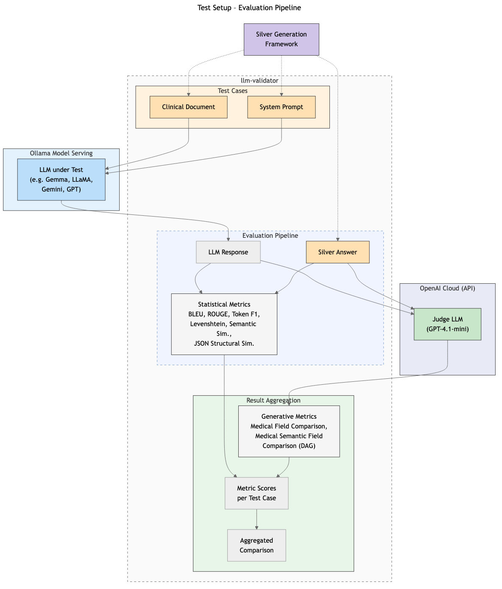
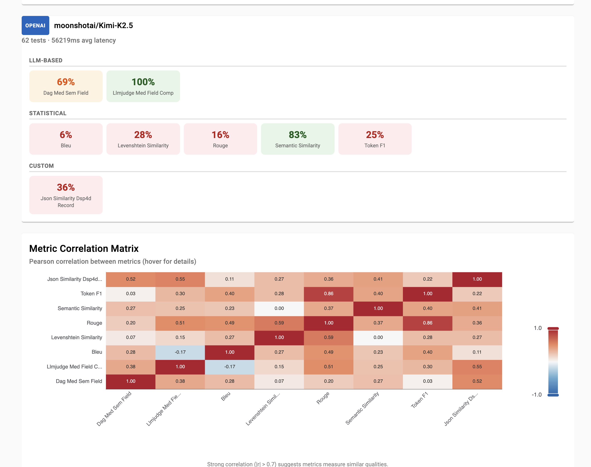
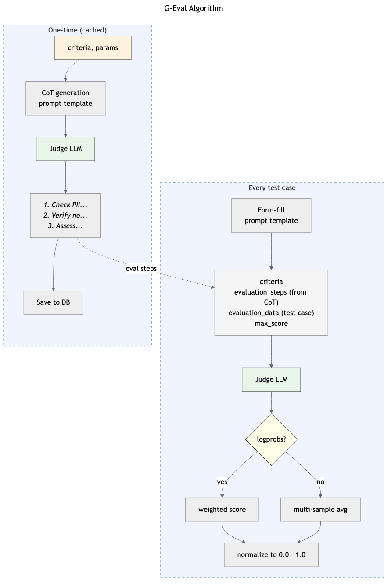

# Methodology

**Development of an Algorithmic Framework for Resource-Efficient Local LLM Selection**

The primary objective of this study is the development of an algorithmic selection framework designed to identify the most resource-efficient Large Language Model (LLM) suitable for local execution. By validating output quality against a set of verified "Golden Answers", this research seeks to establish an optimal equilibrium between computational performance and data sovereignty. The proposed algorithm argues for a shift away from maximalist parameter counts towards targeted efficiency without compromising output fidelity.

## Procedure


The research design follows a rigorous four-phase methodological approach to ensure reproducibility and statistical significance:

### Phase I: Dataset Curation and Establishment of Ground Truth
The initial phase focuses on the identification and preprocessing of a stable text corpus. This corpus serves as the foundational bedrock for deriving "Golden Answers" (Ground Truth). Establishing this baseline is critical, as it functions not only for the initial assessment of the chosen State-of-the-Art (SOTA) LLM but also acts as the immutable comparative benchmark during the subsequent model evaluation phases.

### Phase II: Automated Generation and Supervised Validation of Reference Solutions
In this step, a selected high-performance LLM is utilised to generate high-fidelity "Golden Answers". To ensure domain-specific accuracy, these outputs undergo a supervised review and validation process by a qualified subject matter expert (General Practitioner). Concurrently, various prompt engineering techniques are evaluated, with sessions systematically logged. This data retention is essential to argue whether complex prompting strategies yield comparable performance enhancements when applied to significantly smaller models later in the process.

### Phase III: Technical Implementation of the Multi-Model Evaluation Pipeline
A robust evaluation framework is engineered to assess a diverse array of LLMs, varying in architecture, quantisation, and parameter size. The system is designed to task these models with reproducing the "Golden Answers" derived from the corpus in Phase I. Consistent with Phase II, the previously identified prompt engineering strategies are re-evaluated within this constrained environment. The pipeline captures comprehensive performance metrics, generating the necessary empirical data input for the final analysis.

### Phase IV: Statistical Analysis and Optimal Model Identification
The concluding phase involves a multi-dimensional assessment of the generated data to isolate the optimal model. This includes the application of context-aware content metrics as well as an "LLM-as-a-Judge" paradigm to comparatively evaluate the semantic quality of the outputs. By synthesising these qualitative and quantitative insights, the study identifies the specific LLM that strictly adheres to the pre-defined requirements, thereby validating the feasibility of high-quality, local, and resource-efficient generative AI.

 
## Data Source: GraSCCo

Instead of generic document types, this research utilizes the **Graz Synthetic Clinical text Corpus (GraSCCo)** [@GraSCCo_PII_V2_2025; @modersohn2022grascco]. 

GraSCCo is the first publicly shareable, multiply-alienated German clinical text corpus, designed specifically for clinical NLP tasks without compromising 
patient privacy.

The corpus provides a diverse set of clinical scenarios, which we use to evaluate the models' ability to classify document intent and generate appropriate 
clinical actions based on German-language clinical reports.

The task we give the models is to update a patients health record (HBA) based on supplied clinical report. 

## Golden Answer Generation

Due to the lack of a specialized medical background, we use a State-of-the-Art (SOTA) Large Language Model (LLM) to generate initial "Silver Answers". These serve as preliminary structured outputs derived from the GraSCCo medical corpus. To ensure the high quality and clinical validity of these answers, a subset of the LLM-generated responses undergoes evaluation by one or more medical experts. This human-in-the-loop verification allows us to refine the outputs into a "Gold Standard" (Golden Answers) additionally suitable for benchmarking smaller models.

### Preparation Work

To ensure a structured and scientifically sound prompt engineering process, the following preparatory steps were undertaken in collaboration with medical professionals.

#### Medical Context Stratification

The reports from the **GraSCCo** corpus were categorized into specific medical fields. This stratification allows for a granular comparison of model performance across different clinical contexts and enables an evaluation of the models' ability to correctly assign documents to their respective domains.

The following categories were defined for this study:

* Oncology
* Neurology
* Psychiatry
* Cardiology
* Internal Medicine
* Surgery
* Orthopedics
* Ophthalmology
* Dermatology

#### Standardized Output Format

In collaboration with a **General Practitioner (GP)**, a simplified output format was developed. This structure serves as the template for the prompt's output, allowing for the isolated evaluation of partial results and specific data extraction capabilities.

The standardized format consists of the following six sections:

1. **Categories:** One or more precise categories from the predefined list above.
2. **Date and Source:** The date of the report and the issuing entity (e.g., institute, clinic, or specific physician).
3. **Diagnosis:** The specific diagnosis as documented by the author of the original report.
4. **Relevant Metrics:** Extraction of laboratory values, measurement data (e.g., blood pressure, BMI), and other clinical parameters.
5. **Current or Advised Medications:** A list of medications, specifically distinguishing between the patient’s **current** medication and **recommended/prescribed** new treatments.
6. **Follow-up:** Extraction of the next clinical steps or planned interventions mentioned in the report.

#### Prompt Constraints and Data Integrity

To minimize "hallucinations" and ensure clinical reliability, the prompt instructions include strict constraints:

* **Evidence-Based Extraction:** The model is instructed to only output values if there is a clear and unambiguous reference within the source text.
* **Linguistic Consistency:** The output must be generated in the **original language** of the document (German) to maintain technical accuracy and prevent translation errors during the extraction phase.

### Selection of Prompting Technique: Chain-of-Thought (CoT)

To generate these Silver Answers, we have selected Chain-of-Thought (CoT) prompting. Based on the Comprehensive Comparison of Prompting Techniques, CoT was chosen over other methods for the following strategic reasons:
* Clinical Reasoning Alignment: CoT instructs the model to generate intermediate reasoning steps. In a medical context, this is critical for connecting implied symptoms to explicit medical codes and prevents the model from "skipping" vital clinical details.
* Reduced Hallucinations: By breaking down the task—for example, listing medications first, then checking their historical status, and finally formatting the output—the model is less likely to produce the formatting inconsistencies or "guesses" typical of Zero-Shot prompting.
* Structural Integrity: Unlike simpler techniques, CoT allows for the separation of the "thought" process from the final "golden answer," ensuring

[See: Comprehensive Comparison of Prompting Techniques](#appendix-promp-techs)

While techniques like Self-Consistency or Multi-Persona Prompting offer higher reliability, they were deemed less efficient for this stage due to significantly higher complexity, computational costs and latency. CoT provides the optimal balance between reasoning depth and token efficiency for clinical document classification.

| **Feature** | **Standard Prompt** | **Chain of Thought Prompt** |
|-------------|---------------------|-----------------------------|
| **Processing Style**	| Pattern matching & Direct Extraction	| Logical deduction & Evidence-first |
| **Accuracy** | High for simple reports | Superior for complex, conflicting reports |
| **Hallucination Risk** | Moderate (may guess missing values) | Lower (reasoning step identifies gaps) |
| **Token Usage** | Low (Cost-efficient) | Higher (More verbose output) |
| **Auditability** | Difficult (Only the result is visible) | Transparent (You see why it chose a category) |

### System Prompt: Clinical Data Extraction (CoT)

In a medical context, this is particularly valuable because it forces the LLM to identify the evidence in the text before committing to a category or a medication status. This reduces "lazy" extractions where a model might miss a nuance (like a medication being discontinued).

**Used prompt:**

```text
Role: You are an expert Medical Registrar. Extract data into a structured
JSON format.

Constraints:
1. Factuality: Extract information ONLY if explicitly stated. 
2. Language: Content values must be in the original document language (German).
3. Format: Output ONLY a single valid JSON object.

Available Categories: You MUST choose one or more from this specific list: 
["Onkologie", "Neurologie", "Psychiatrie", "Kardiologie", "Innere Medizin",
 "Chirurgie", "Orthopädie", "Ophthalmologie", "Dermatologie"]

Methodology: Use the "internal_monologue" to analyze the text step-by-step
before populating the final fields.

Output Schema:
{
 "internal_monologue": {
  "1": "Identify the documents creation date and author or institutions",
  "2": "List diagnoses and primary reason",
  "3": "Locate numerical metrics",
  "4": "Distinguish current vs. advised medication",
  "5": "Identify follow-up instructions"
 },
 "structured_health_record": {
  "categories": ["Must be from the list above"],
  "date_and_source": "YYYY-MM-DD; Institution/Doctor",
  "diagnosis": "Documented diagnosis",
  "relevant_metrics": "Lab values and vitals",
  "medications": {
      "current": "What the patient is already taking",
      "advised": "New prescriptions or changes"
  },
  "follow_up": "Next steps"
 }
}

Source Text:
{document}
```

[Gold Standard Example (CoT Approach)](#appendix-gold-standard)

### Ground Truth Generation and Annotation Platform
To facilitate the seamless generation and validation of these answers, we developed a dedicated web application. This platform serves three primary functions:

* **Accessibility:** It allows researchers and medical experts to access the data and provide feedback from any location at any time.
* **Centralized Storage:** It records both the raw LLM outputs (Silver Answers) and the subsequent expert feedback/corrections.
* **Data Pipeline Integration:** The application is designed to automatically export these validated results into the specific input format required by our evaluation framework, ensuring a smooth transition from annotation to model benchmarking.

The platform consists of the following components:

**Session Framework**

The core of the platform is organized into Sessions. A Session acts as the functional container for processing input documents into "Silver Answers" and managing the subsequent expert annotation process.

**Input Documents**

This component manages the medical corpora, specifically the GraSCCo raw text files. Users can upload or reference specific documents that require clinical document classification or data extraction.

**Configuration & Prompt Engineering**

The platform allows for sophisticated prompt management. While it supports single-prompt execution, it is optimized for Prompt Chaining—breaking complex medical tasks into subtasks (e.g., Extraction -> Filtering -> Formatting) to isolate errors and improve reliability.
To ensure clinical accuracy, users can fine-tune the following model parameters:
* Temperature: Controls randomness. For medical extraction, a lower range of 0.2–0.5 is recommended to ensure deterministic, consistent, and predictable outputs.
* Max Output Tokens: Defines the response length. We recommend 1024–2048 for concise outputs or 4096–8192 for detailed clinical extractions
* Top-K Sampling: Limits the model to the $K$ most likely tokens. A setting of 10–40 balances consistency with the flexibility needed for medical terminology.
* Top-P (Nucleus Sampling): Selects tokens based on a cumulative probability $P$. A value of 0.8–0.9 is ideal for maintaining clinical accuracy while allowing for varied medical phrasing.

**Execution & Metrics**

This module provides real-time visibility into the generation process. It tracks Execution Status and critical performance metrics, including:
* Token Consumption: Monitoring input and output volume.
* Cost & Quality: Assessing the financial efficiency and the perceived reliability of the "Silver Answers".

**Results & Annotation**

Once execution is complete, the platform displays the generated answers for each input document. This interface is designed for the human-in-the-loop phase, allowing medical experts to:
* Review execution details for each document.
* Annotate and provide feedback to correct hallucinations or omissions.
* Download the final validated results in a standardized exchange format for use in the study’s evaluation framework.

**Administrative Modules**

Beyond the session workflow, the platform includes User Management to control expert access and API Configuration to query sessions and results.

## Selecting Smaller Large Language Models (SLM) for the Evaluation

The objective is to identify a set of 5 SLMs that can run locally on consumer-grade hardware while maintaining enough semantic understanding to process (synthetic) clinical texts.

While a comprehensive understanding of general-purpose context may be disregarded, it important that the models demonstrate a robust understanding of clinical context and the ability to perform precise information extraction. Furthermore, our selection criteria for SLMs are not strictly limited to models with specialized medical pre-training. Rather, we aim to investigate the inherent suitability and performance of general-purpose models within this specialized domain.

Because we are evaluating SLMs answers against "Silver/Golden Answers" derived from a larger model (Gemini) and human verification, the selected SLMs must be capable of strict instruction following to ensure their outputs can be parsed and scored by our custom evaluation framework. The selection procedure prioritizes models that show "emergent" reasoning capabilities usually reserved for larger models, while remaining compressible enough to fit in local (V)RAM.  [See: Selection of Prompting Technique: Chain-of-Thought](#selection-of-prompting-technique-chain-of-thought-cot)

### Procedure: Selection Criteria for 'suitable' Clinical SLMs

To filter the hundreds of available open-source models down to a manageable set, we use this five criteria in order.

**1. Hardware-Aware Parameter Efficiency**

* **Criterion:** Models must have between 7B to 20B parameters that support 4-bit or 8-bit quantization
* **Why:** A standard laptop/desktop with 16Gb Memory (shared or dedicated VRAM) cannot run a 20B model at 16-bit full precision (FP16).
For Example: 
    * A 7B model requires ~16GB RAM at FP16 but only 5GB to 6GB at 4-bit quantization
    * A 14B model requires ~30GB at FP16 but fits into 10GB to 12GB at 4-bit, making it feasible for professional consumer desktops
    * Hence a 18B model at 4-bit quantization will still meet the criterion
* **Selection:** Exclude any models <=18B consider choosing higher bit-quantization for smaller models.
[LLM Model Parameters 2025](https://local-ai-zone.github.io/guides/what-is-ai-model-3b-7b-30b-parameters-guide-2025.html)

**2. High Reasoning & Knowledge Benchmark Scores**

* **Criterion:** Prioritize models with high scores on MMLU-Pro disciplines Biology, Chemistry, Health and Psychology
* **Why:**  Clinical text annotation is not just text generation. It is a reasoning task. Standard benchmarks like MMLU are becoming saturated and less discriminative. MMLU-Pro better distinguishes models that "understand" complex topics versus those that just guess.
* **Selection:** Based on the MMLU-Pro Leaderboards: Select models that outperform in Biology, Chemistry, Health and Psychology and provide "Reasoning" or "Thinking" to reduce hallucination. See Table below.

**3. Instruction Following & Output Structure**

* **Criterion:** Select "Instruct" or "Chat" rather than base models
* **Why:** We compare SLM output against Silver/Golden Answers. If the SLM cannot follow instructions, we simply get the output of a "completion engine" not an assistant. Base trained models lack intent recognition.
* **Selection:** Choose the "Instruct" or "Chat" variants

**4. Context Window Capacity**

* **Criterion:** Minimum context window of 8k tokens (preferably 32k+ or higher)
* **Why:** Clinical notes can be lengthy. If a diagnosis or generally a patient report exceeds the model's context window, the model will "forget" early information, leading to missed health information annotations. Newer architectures support massive context windows, allowing the model to read a full report in one pass
* **Selection:** Discard models with <8k context limits

**5. License & Data Sovereignty**

* **Criterion:** Permissive licenses (Apache 2.0, MIT) allowing local commercial use
* **Why:** The primary advantage of SLMs in healthcare is data sovereignty—running locally so patient data never leaves the machine. Open-source models allow to inspect the model and ensure no data is sent to external APIs.
* **Selection:** Model is truly open source (and does not require any API calls)

**Proposed set of SLMs for Evaluation**

| Models | Qualifier | Context Window | License | Size (B) | Remarks |
|--------|-----------|----------------|---------|----------|---------|
| GLM-4-9B-Chat | Chat | 128k | MIT | 9 | |
| Mistral-Nemo-IT-2407 | Instruct | 128k | Apache 2.0 | 12 | |
| Qwen2-7B-Instruct | Instruct | 32k | Apache 2.0 | 7 | |
| Phi-3.5-mini-instruct | Instruct | 128k | MIT | 3.8 | |
| Llama-3-8B-Instruct | Instruct | 8k | |
| Granite-3.3-2B | Instruct | 128k | Apache 2.0 | 2 | Additional to have a really small one |

**If we want to use models under Llama 3.1, Gemma or Qwen license we need to integrate following NOTICE text:**

```
ATTRIBUTION NOTICE

- If using Gemma: "Gemma is provided under and subject to the Gemma Terms of Use found at ai.google.dev/gemma/terms".
- If using Llama 3.1: "Llama 3.1 is licensed under the Llama 3.1 Community License, Copyright © Meta Platforms, Inc. All Rights Reserved".

EULA Compliance Template

Section X: AI Usage and Compliance
X.1 License Grant and Pass-Down Terms. Licensor grants Customer a limited license to use the Software incorporating [Insert Model Name, e.g., Gemma 2 / Llama 3.1]. This Software is subject to the [Insert Model Terms, e.g., Gemma Terms of Use / Llama 3.1 Community License], which are incorporated herein by reference.

X.2 Professional Advice Disclaimer. The Software is an automated tool and is NOT a substitute for professional medical, legal, financial, or other licensed advice. Customer agrees that:
- Output will not be used as authoritative for the unlicensed practice of medicine, law, or financial services.
- All high-stakes outputs must be reviewed and authorized by a qualified human professional before any action is taken.

X.3 Prohibited Use & Safety. Customer shall not use the Software to:
- Generate or facilitate illegal activities, violence, or terrorism.
- Engage in harassment, bullying, or unlawful discrimination.
- Create malicious code, malware, or viruses.
- Deceive or mislead others, including the creation of disinformation or fake reviews.

X.4 Local Deployment and Liability. As the Software is deployed locally on Customer’s private infrastructure, Customer assumes all risk associated with the use and distribution of the Software and its results. Customer shall indemnify and hold harmless [Your Company Name] and the Model Provider (e.g., Google/Meta) from any third-party claims arising out of Customer’s breach of these safety or professional advice policies.

X.5 Termination for Misuse. [Your Company Name] reserves the right to terminate this Agreement immediately and without notice if Customer is found to be in violation of the safety or acceptable use policies mandated by the Model Provider.
```


## Experimental Setup

### Architecture
TODO BNI Maschine von Beni, Google cloud für Gemini 

### Silver Answer App
The Silver Answers App is a cloud-based web application that automates AI-powered document analysis using Google's Gemini large language model. The system enables researchers to process document collections through configurable prompt chains, evaluate results, and iteratively refine their analytical approaches. Built with React and Node.js, it integrates Google Cloud Platform services for AI processing and persistent storage.

#### Three-Tier Architecture

**Frontend (React 18.2.0)**
- Single-page application with four primary panels
- Component-based UI with real-time state management
- Custom dark mode styling

**Backend (Node.js/Express 4.18.2)**
- RESTful API with service-oriented architecture
- Middleware for error handling, CORS, and rate limiting
- Asynchronous processing with progress callbacks

**Cloud Services (Google Cloud Platform)**
- Vertex AI for Gemini API integration
- Cloud Storage for persistent data
- Service account-based authentication

#### Technology Stack

**Frontend:** React, Axios, react-beautiful-dnd (drag-and-drop), react-modal

**Backend:** Express, @google-cloud/vertexai, @google-cloud/storage, express-rate-limit

**Cloud:** GCP Project (cas-gen-ki), Vertex AI (Gemini 2.5 Flash), Cloud Storage (europe-west6)

#### Frontend Components

**1. Session Manager**
- Orchestrates work sessions binding document bases, prompt sets, and results
- Session creation, switching, and deletion
- Auto-loading for improved UX

**2. Document Base (DocsBase)**
- Manages document collections for AI processing
- JSON upload with URL references (Zenodo integration)
- Folder upload with text file embedding
- Document preview and metadata display

**3. Prompt Engineering**
- Creates and configures prompt chains
- Drag-and-drop reordering
- Token estimation and validation
- Prompt set saving for reusability

**4. Prospect Answers**
- Displays generation results hierarchically
- Expandable document sections
- Intermediate step visualization
- Token usage statistics

**5. Answer Details**
- Detailed result view with rating interface
- Star rating system (1-5)
- Comment and human correction fields
- Rating persistence to session

#### Backend Services

**Gemini Service**
- Vertex AI client initialization
- Token estimation (1 token $\approx$ 4 characters)
- Content generation with system instructions
- Document chain processing with cumulative context
- Comprehensive API logging

**Processor Service**
- Document content fetching from URLs
- Multi-document batch processing
- Progress callback system
- Error handling with partial result preservation

**Storage Service**
- GCS file operations (upload, download, list, delete)
- JSON serialization/deserialization
- Error handling for cloud operations

#### API Endpoints

**Documents:** GET/POST/DELETE for document base management

**Sessions:** Full CRUD operations, prompt management, result storage

**Generation:** Start generation, check status, retrieve results

**Ratings:** Save and retrieve ratings (embedded in sessions)

**Prompt Sets:** Manage reusable prompt configurations

#### Session-Based Workflow

**1. Initialization:** Create/select session, choose document base and prompt set

**2. Configuration:** Upload documents, create/load prompts, validate configuration

**3. Generation:** Process documents through prompt chain sequentially, track tokens, store results

**4. Evaluation:** Review results, provide ratings and corrections, save to session

**5. Iteration:** Modify prompts, re-run generation, compare results across runs

#### Prompt Chain Processing

The system implements sequential prompt chains where each output feeds into the next:

```
Initial: Input = Document Content

Prompt 1: System instruction + Document → Analysis_1
Prompt 2: Document + Analysis_1 + User prompt → Analysis_2
Prompt N: Document + All Previous Analyses → Final Answer
```

**Token Growth:** Each step adds previous outputs to context, requiring careful token management.

#### Data Persistence

**GCS Structure:**
```
gs://cas-gen-ki-golden-answers/
|-- config.json              # App configuration
|-- docbases/                # Reusable document collections
|-- prompt-sets/             # Reusable prompt configurations
`-- sessions/                # Work sessions with results
```

**Characteristics:** JSON-based, timestamp IDs, no database required, lazy loading, in-memory caching

#### Google Cloud Platform Integration

##### Authentication
- Service account: `golden-answers-engine@cas-gen-ki.iam.gserviceaccount.com`
- IAM roles: `aiplatform.user` (Vertex AI), `storage.objectAdmin` (GCS)
- Key file stored locally, referenced via environment variable

##### Vertex AI Configuration
```json
{
  "model": "gemini-2.5-flash",
  "temperature": 0.7,
  "maxOutputTokens": 2048,
  "topK": 40,
  "topP": 0.95
}
```

##### Cloud Storage
- Bucket: `cas-gen-ki-golden-answers` (Switzerland region)
- Private access via service account
- JSON file-based storage for all data

##### Session Management
- **Reusability:** Document bases and prompt sets reused across sessions
- **Continuity:** Resume work from any point
- **Organization:** Logical grouping of related work
- **History:** Complete audit trail of generation runs

##### Prompt Engineering
- System prompts (set AI behavior) and User prompts (specific tasks)
- Visual drag-and-drop reordering
- Real-time token estimation
- Save/load prompt sets
- Supports chain-of-thought and iterative refinement

##### Document Processing
- Batch processing with progress tracking
- URL-based (Zenodo) and text-based documents
- Partial result preservation on errors
- Token usage tracking per document

##### Result Evaluation
- 1-5 star ratings with comments
- Human correction/ground truth field
- View intermediate prompt results
- Compare across generation runs
- Token usage and processing time metrics

##### Token Management
- Real-time estimation during configuration
- Limits: ~30,000 input tokens, configurable output (default 2,048)
- Warnings at 80% of limits
- Per-prompt, per-document, and per-generation tracking

#### Security and Performance

**Security**
- Service account with minimal permissions
- CORS configuration and rate limiting (60 req/min)
- Private GCS bucket access
- No hardcoded credentials

**Performance**
- Asynchronous processing for long tasks
- Progress callbacks for real-time updates
- In-memory configuration caching
- Efficient React re-rendering


## Evaluation Metrics

The following metrics are used to evaluate LLM outputs, divided into statistical metrics (no LLM call required) and generative metrics (LLM-as-a-Judge). For detailed mathematical definitions and implementation specifics, see [Appendix: Evaluation Metrics Reference](#appendix-metrics-reference).

**Statistical Metrics:**

- **BLEU** (*Bilingual Evaluation Understudy*): Measures n-gram overlap between generated and expected output. Reports brevity penalty and 1- to 4-gram precision.
- **ROUGE** (*Recall-Oriented Understudy for Gisting Evaluation*): Evaluates overlap based on ROUGE-1 (unigram), ROUGE-2 (bigram), and ROUGE-L (longest common subsequence).
- **Token F1**: Computes precision, recall, and F1 score at the token level between generated and expected output.
- **Levenshtein Similarity**: Determines character-level similarity via normalised edit distance.
- **Semantic Similarity**: Compares semantic similarity using embedding vectors (model: `text-embedding-3-small`).
- **JSON Structural Similarity**: Evaluates structural correspondence of JSON output by matching paths and their contents.

**Generative Metrics (LLM-as-a-Judge):**

- **Medical Field Comparision**: An LLM evaluates the factual correctness of the generated output against the golden answer on a scale from 0 to 1. It is defined as one shot as close as possible to the DAG metric with the goal tom make them comparable.
- **Medical Semantic Field Comparision**: A multi-step, graph-based evaluation (Directed Acyclic Graph) that assesses format validity, factual accuracy, completeness, and medical terminology in separate steps, aggregating them into an overall score.

### Test Setup

{#fig:test-setup width=70%}


#### llm-validator

To facilitate the systematic evaluation described in Phase III and IV, a purpose-built evaluation framework — *llm-validator* — was developed as part of this research. The tool serves as the central instrumentation layer for capturing, executing, and assessing LLM interactions across multiple models and prompting strategies.

**Technology Choice.** The framework is implemented in Java 21 using the Quarkus application framework, with LangChain4j for LLM integration and an Angular-based web interface for result inspection. The deliberate choice of a JVM-based stack over the more prevalent Python ecosystem in the LLM domain is motivated by the project's alignment with healthcare IT environments: Java remains the dominant technology in enterprise and clinical information systems in Switzerland and the DACH region. By building the evaluation tooling on this stack, the resulting artefact is not only a research instrument but also a reusable component that can be integrated into existing institutional infrastructure without introducing foreign runtime dependencies.

**Evaluation Pipeline.** The core contribution of the tool lies in its multi-dimensional evaluation pipeline. Test cases — each comprising a clinical query, an optional system prompt, and a golden answer — are organised into *Test Runs* and executed in batch against one or more models. The framework then applies two categories of evaluation metrics:

- **Statistical metrics** (no LLM required): Token-level F1 score, Levenshtein similarity, and embedding-based semantic similarity provide quantitative baselines for output comparison.
- *LLM-as-a-Judge metrics** (): both a "simple" one shot and a more sophisticated DAG metric are calculated.


{#fig:llm-validator width=75%}

#### JSON Structural Similarity

A custom metric was developed to assess how well a model's JSON output conforms to the expected schema. The algorithm flattens both the model output and the Silver Answer into leaf-path maps, aligns array elements via greedy best-match, and computes normalised Levenshtein similarity per leaf pair. The overall score is the arithmetic mean across all leaves. For a detailed description see [Appendix: JSON Structural Similarity Algorithm](#appendix-json-sim).

#### DAG-Based Medical Extraction Quality

To evaluate clinical quality beyond what statistical metrics can capture, a Directed Acyclic Graph (DAG) evaluation metric was developed. Unlike single-prompt LLM-as-a-Judge approaches, the DAG metric decomposes the evaluation into multiple specialised assessment tasks executed by the judge LLM. The medical extraction quality graph evaluates four parallel dimensions — format compliance, factual accuracy, completeness, and medical terminology — and averages their scores. For a detailed description of the execution engine and the graph structure see [Appendix: DAG-Based Medical Extraction Quality Algorithm](#appendix-dag).

{#fig:geval-algorithm width=75%}

#### The Logprobs Problem in G-Eval

The central mechanism of G-Eval is probability-weighted scoring: rather than taking the LLM's generated score at face value, the token log-probabilities of the score tokens (e.g. "1" through "5") are extracted and a weighted average is computed [@liu2023geval]. This approach significantly reduces the known scoring bias of LLMs and is the primary reason for G-Eval's superior human correlation compared to naive LLM-as-a-Judge approaches.

However, the `logprobs` feature that enables this weighted scoring is not uniformly supported across LLM providers. Table \ref{tab:logprobs-compat} summarises the current compatibility landscape.

| Provider | Logprobs | Notes |
|----------|----------|-------|
| OpenAI (standard models) | Yes      | gpt-4o, gpt-4.1-mini etc. via `/v1/chat/completions` |
| OpenAI (reasoning models) | **No**   | o-series, gpt-5-mini — `logprobs` not supported, `temperature` fixed at 1.0 |
| vLLM (self-hosted) | Yes      | Any HuggingFace model; logprobs reflect raw model output before post-processing |
| Together.ai | Yes      | Open-weight models via OpenAI-compatible API |
| Ollama | **No**   | Logprobs only on native `/api/generate`, not on OpenAI-compatible `/v1/chat/completions` |
| LM Studio | **No**   | Accepts `top_logprobs` on `/v1/responses` (since v0.3.26, Jan 2026) but returns empty arrays in practice |
| llama.cpp server | **No**   | Returns `null` for logprobs on `/v1/chat/completions` |

: Logprobs compatibility by LLM provider (as of February 2026) {#tab:logprobs-compat}

Particularly problematic is the incompatibility with reasoning models (OpenAI o-series, gpt-5-mini, gpt-5-nano). These models employ an internal reasoning phase that consumes tokens from the `max_completion_tokens` budget before any visible output is produced. For a task that merely requires a single integer score, reasoning models are architecturally unsuitable: they spend hundreds of tokens on internal deliberation for a trivial decision — while supporting neither `logprobs` nor configurable `temperature` values.

This problem also affects existing reference implementations. DeepEval, the most widely used Python implementation of G-Eval, works around the issue with a hardcoded list of reasoning models for which it falls back to plain JSON extraction without probability weighting — which de facto is no longer G-Eval but a simple LLM-as-a-Judge approach. Several open issues document this limitation: reasoning models break G-Eval entirely^[<https://github.com/confident-ai/deepeval/issues/1358>], custom (non-OpenAI) models never receive weighted summation^[<https://github.com/confident-ai/deepeval/issues/1831>], and the fallback from weighted to unweighted scoring occurs silently without warning^[<https://github.com/confident-ai/deepeval/issues/1029>].


A promising alternative for local execution is vLLM, a high-throughput self-hosted inference engine that provides full logprobs support on its OpenAI-compatible API for any HuggingFace model. While vLLM returns logprobs from the model's raw output (before temperature scaling or penalty adjustments), this is sufficient for G-Eval scoring where the probability distribution over score tokens is the quantity of interest. Due to time constraints we did not engineer vLLM into our evaluation pipeline. 

**Fallback strategy.** For providers without logprobs support, the G-Eval paper defines an alternative method: *multi-sample estimation* with $n=20$ independent calls at `temperature=1.0`, where each response is parsed for an integer score and the results are averaged [@liu2023geval]. This procedure approximates the probability distribution through sampling and thus remains faithful to the G-Eval   algorithm — albeit at significantly higher cost (factor 20 compared to the logprobs variant). Practically this turned out to be problematic since this lead to rejected API calls (Vertex AI) or not acceptable performance (local LMStudio).

**Consequence for judge model selection.** The choice of judge model for G-Eval evaluation is therefore constrained: either a non-reasoning cloud model with logprobs support is used (e.g. gpt-4o-mini), a self-hosted vLLM instance serves as judge, or the cost-intensive multi-sample fallback is required. For this study, an auto-detection strategy is implemented that first attempts the logprobs path and automatically falls back to multi-sample upon failure — enabling both cloud APIs and local models to serve as judges.

