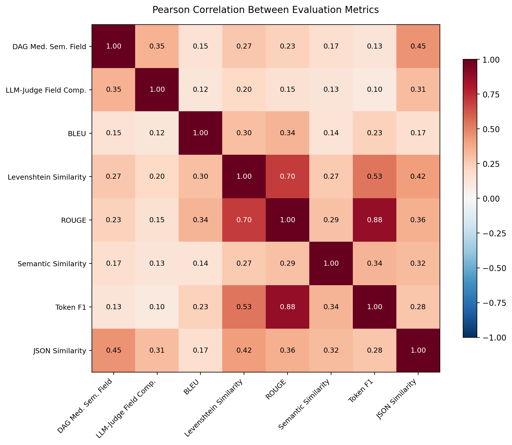

<!-- #R-INTRO — AI-generated (Claude, Feb 2026) — see paper/INSTRUCTIONS.md -->

# Results

This chapter presents the empirical findings of the Zero-Shot evaluation run across all nine models and 62 test cases from the GraSCCo corpus. Each test case was evaluated using eight metrics spanning statistical, embedding-based, and LLM-as-a-Judge categories.

## Overview of Models and Evaluation Metrics

Nine models were evaluated: one large cloud model (Gemini 2.5 Pro via Vertex AI), one small cloud model (GPT-5-nano via OpenAI), and seven locally executable SLMs ranging from 2B to 27B parameters. All models received the identical system prompt and clinical input documents in a Zero-Shot configuration — no few-shot examples or retrieval augmentation was applied.

The evaluation framework applied eight metrics per interaction, categorised into three groups:

- **Statistical metrics** (deterministic, no model required): BLEU, ROUGE, Levenshtein similarity, Token F1, and JSON structural similarity. These measure lexical overlap and structural conformance between the model output and the Silver Answer.
- **Embedding-based metric** (requires an embedding model, but no generative LLM): Semantic similarity, computed via cosine distance on text-embedding-3-small vectors. This metric captures whether the output conveys the same meaning as the Silver Answer, independent of exact wording.
- **LLM-as-a-Judge metrics** (require a generative LLM as evaluator): DAG medical extraction quality and LLM-Judge correctness. These employ an LLM to assess the clinical quality and overall correctness of the extracted content against the Silver Answer.

## Impact of LLM Size

### Aggregate Performance

<!-- #R-TAB-STAT — regenerate from JSON, see INSTRUCTIONS.md -->
Table \ref{tab:avg-scores} presents the mean scores across all 62 test cases per model and metric.

The following three tables present the mean scores grouped by metric category.

**Statistical Metrics** (deterministic, no model required):

| Model | Size | BLEU | ROUGE | Levenshtein | Token F1 | JSON Sim. |
|-------|------|------|-------|-------------|----------|-----------|
| gemini-2.5-pro | Large | 0.122 | 0.254 | 0.377 | 0.380 | 0.440 |
| gemma3:27b | 27B | 0.080 | 0.210 | 0.343 | 0.309 | 0.372 |
| gpt-5-nano | Small | 0.085 | 0.201 | 0.318 | 0.313 | 0.272 |
| granite3.3:2b | 2B | 0.085 | 0.165 | 0.317 | 0.266 | 0.254 |
| mistral-nemo | 12B | 0.080 | 0.189 | 0.336 | 0.275 | 0.059 |
| glm4:9b | 9B | 0.072 | 0.170 | 0.322 | 0.259 | 0.255 |
| qwen2:7b | 7B | 0.054 | 0.159 | 0.291 | 0.270 | 0.160 |
| phi3.5:3.8b | 3.8B | 0.077 | 0.115 | 0.287 | 0.218 | 0.103 |
| llama3:8b | 8B | 0.077 | 0.160 | 0.314 | 0.245 | 0.000 |

: Mean statistical metric scores per model across 62 test cases (Zero-Shot). {#tab:avg-scores-stat}

<!-- #R-TAB-JUDGE — regenerate from JSON, see INSTRUCTIONS.md -->
**Embedding-Based Metric** (requires embedding model) and **LLM-as-a-Judge Metrics** (require generative LLM as evaluator):

| Model | Size | Sem. Sim. | DAG | LLM-Judge |
|-------|------|-----------|-----|-----------|
| gemini-2.5-pro | Large | 0.835 | 0.619 | 0.730 |
| gpt-5-nano | Small | 0.861 | 0.593 | 0.707 |
| gemma3:27b | 27B | 0.790 | 0.520 | 0.702 |
| granite3.3:2b | 2B | 0.843 | 0.528 | 0.659 |
| qwen2:7b | 7B | 0.765 | 0.508 | 0.675 |
| phi3.5:3.8b | 3.8B | 0.797 | 0.479 | 0.628 |
| glm4:9b | 9B | 0.732 | 0.433 | 0.660 |
| mistral-nemo | 12B | 0.794 | 0.261 | 0.643 |
| llama3:8b | 8B | 0.650 | 0.475 | 0.636 |

: Mean embedding and LLM-as-a-Judge scores per model across 62 test cases (Zero-Shot). {#tab:avg-scores-judge}

<!-- #R-TAB-COMPOSITE — regenerate from JSON, see INSTRUCTIONS.md -->
### Composite Scores by Metric Category

To provide a consolidated view, Table \ref{tab:composite} aggregates the metric averages into three categories and an overall composite score.

| Model | Size | Statistical | Embedding | LLM-as-a-Judge | Overall | Avg. Latency (ms) |
|-------|------|-------------|-----------|----------------|---------|-------------------|
| gemini-2.5-pro | Large (Cloud) | 0.315 | 0.835 | 0.675 | 0.470 | 22'259 |
| gpt-5-nano | Small (Cloud) | 0.238 | 0.861 | 0.650 | 0.419 | 44'443 |
| gemma3:27b | 27B | 0.263 | 0.790 | 0.611 | 0.416 | 69'136 |
| granite3.3:2b | 2B | 0.217 | 0.843 | 0.593 | 0.390 | 16'506 |
| glm4:9b | 9B | 0.216 | 0.732 | 0.547 | 0.363 | 20'237 |
| qwen2:7b | 7B | 0.187 | 0.765 | 0.591 | 0.360 | 15'730 |
| phi3.5:3.8b | 3.8B | 0.160 | 0.797 | 0.554 | 0.338 | 20'197 |
| mistral-nemo | 12B | 0.188 | 0.794 | 0.452 | 0.330 | 24'556 |
| llama3:8b | 8B | 0.159 | 0.650 | 0.556 | 0.320 | 17'002 |

: Composite scores (mean of metric averages) by category. Statistical = 5 lexical/structural metrics; Embedding = semantic similarity (text-embedding-3-small); LLM-as-a-Judge = 2 generative evaluation metrics. {#tab:composite}

Gemini 2.5 Pro achieves the highest overall composite score (0.470), followed by GPT-5-nano (0.419) and Gemma3:27b (0.416). Among the locally executable SLMs, Granite 3.3 (2B) ranks surprisingly high at 0.390 — outperforming several models four to six times its size.

<!-- #R-TAB-PASS — regenerate from JSON, see INSTRUCTIONS.md -->
### Pass Rates

Table \ref{tab:pass-rates} reports the percentage of test cases where each model met or exceeded the metric-specific pass threshold.

| Model | Size | DAG | LLM-Judge | Sem. Sim. | Overall |
|-------|------|-----|-----------|-----------|---------|
| gemini-2.5-pro | Large | 82.3% | 90.3% | 93.5% | 34.3% |
| gpt-5-nano | Small | 83.9% | 85.5% | 100.0% | 33.7% |
| gemma3:27b | 27B | 56.5% | 77.4% | 90.3% | 28.4% |
| granite3.3:2b | 2B | 59.7% | 58.1% | 100.0% | 27.4% |
| phi3.5:3.8b | 3.8B | 50.0% | 48.4% | 85.5% | 23.2% |
| qwen2:7b | 7B | 54.8% | 64.5% | 62.9% | 22.8% |
| mistral-nemo | 12B | 24.2% | 58.1% | 74.2% | 19.6% |
| glm4:9b | 9B | 35.5% | 56.5% | 37.1% | 16.1% |
| llama3:8b | 8B | 50.0% | 50.0% | 8.1% | 13.9% |

: Pass rates for embedding and LLM-as-a-Judge metrics (%). Statistical lexical metrics (BLEU, ROUGE, Levenshtein, Token F1, JSON structural similarity) are omitted as all models achieve near-0% pass rates on these. Overall includes all 8 metrics. {#tab:pass-rates}

The statistical lexical metrics (BLEU, ROUGE, Levenshtein, Token F1) yield near-zero pass rates across all models — including Gemini 2.5 Pro. This indicates that these thresholds are either too strict for the task or that the extraction task inherently permits semantically equivalent but lexically diverse outputs.

<!-- #R-TAB-JSON — regenerate from JSON, see INSTRUCTIONS.md -->
## JSON Structural Compliance

A critical finding concerns the models' ability to produce valid, structurally correct JSON output matching the expected schema. The `json_structural_similarity` metric directly measures this capability.

| Model | Mean | Std | Min | Max |
|-------|------|-----|-----|-----|
| gemini-2.5-pro | 0.440 | 0.078 | 0.272 | 0.658 |
| gemma3:27b | 0.372 | 0.067 | 0.193 | 0.553 |
| glm4:9b | 0.255 | 0.061 | 0.000 | 0.386 |
| gpt-5-nano | 0.272 | 0.084 | 0.000 | 0.426 |
| granite3.3:2b | 0.254 | 0.076 | 0.000 | 0.397 |
| qwen2:7b | 0.160 | 0.101 | 0.000 | 0.366 |
| phi3.5:3.8b | 0.103 | 0.136 | 0.000 | 0.380 |
| mistral-nemo | 0.059 | 0.117 | 0.000 | 0.334 |
| llama3:8b | 0.000 | 0.000 | 0.000 | 0.000 |

: JSON structural similarity distribution per model. {#tab:json-sim}

Llama3:8b scores 0.000 across all 62 test cases, indicating a complete failure to produce parseable JSON matching the required schema. Mistral-Nemo and Phi3.5 also exhibit high variance with many zero-score cases. In contrast, Gemini 2.5 Pro and Gemma3:27b produce consistently structured output with no zero-score cases.

<!-- #R-TAB-SEMANTIC — regenerate from JSON, see INSTRUCTIONS.md -->
## Semantic Understanding vs. Format Compliance

A notable divergence emerges between metrics measuring semantic understanding and those measuring structural compliance. Table \ref{tab:semantic-vs-struct} contrasts the two dimensions.

| Model | Semantic Sim. | LLM-Judge | JSON Sim. | BLEU |
|-------|--------------|-----------|-----------|------|
| gpt-5-nano | 0.861 | 0.707 | 0.272 | 0.085 |
| granite3.3:2b | 0.843 | 0.659 | 0.254 | 0.085 |
| gemini-2.5-pro | 0.835 | 0.730 | 0.440 | 0.122 |
| phi3.5:3.8b | 0.797 | 0.628 | 0.103 | 0.077 |
| mistral-nemo | 0.794 | 0.643 | 0.059 | 0.080 |
| gemma3:27b | 0.790 | 0.702 | 0.372 | 0.080 |
| qwen2:7b | 0.765 | 0.675 | 0.160 | 0.054 |
| glm4:9b | 0.732 | 0.660 | 0.255 | 0.072 |
| llama3:8b | 0.650 | 0.636 | 0.000 | 0.077 |

: Semantic understanding metrics (left) vs. structural compliance metrics (right). {#tab:semantic-vs-struct}

Most models achieve semantic similarity scores above 0.75, indicating that the extracted medical content is semantically close to the Silver Answers. However, the same models frequently fail to structure this content according to the prescribed JSON schema. This gap is most pronounced for GPT-5-nano (semantic similarity 0.861 vs. JSON similarity 0.272) and Granite 3.3 (0.843 vs. 0.254).

<!-- #R-CORRELATION — regenerate heatmap from JSON, see INSTRUCTIONS.md -->
## Metric Correlation Analysis

To understand the relationships between evaluation metrics, Figure \ref{fig:metric-correlation} presents the Pearson correlation matrix computed across all 558 model-document interactions (9 models x 62 test cases).

{#fig:metric-correlation width=85%}

Several patterns emerge from the correlation analysis:

**Strong intra-group correlation among lexical metrics.** Levenshtein similarity, ROUGE, and Token F1 form a tightly correlated cluster (r = 0.54–0.89). This is expected, as all three measure character- or token-level overlap. BLEU correlates moderately with this group (r = 0.36), likely due to its n-gram precision focus versus the recall-oriented nature of ROUGE and Token F1.

**Low correlation between LLM-as-a-Judge and statistical metrics.** DAG medical extraction quality shows near-zero correlation with the lexical metrics (r = -0.02 to 0.15), and LLM-Judge correctness similarly exhibits weak correlations (r = 0.12–0.23). This confirms that the LLM-based evaluators capture a fundamentally different quality dimension — clinical extraction fidelity — that lexical overlap metrics cannot approximate.

**Semantic similarity occupies a middle ground.** While embedding-based semantic similarity correlates weakly with the lexical cluster (r = 0.14–0.33), it also shows only modest correlation with the LLM-as-a-Judge metrics (r = 0.15–0.17). This supports its categorisation as a distinct metric tier: it measures meaning preservation without assessing clinical correctness or structural compliance.

**JSON structural similarity is the most independent structural metric.** It correlates moderately with the lexical group (r = 0.34–0.40) but also shows the highest correlation with semantic similarity (r = 0.39) among the statistical metrics. This suggests that models producing well-structured JSON also tend to generate more semantically accurate content — format compliance and content quality are not independent.

<!-- #R-TAB-LATENCY — regenerate from JSON, see INSTRUCTIONS.md -->
## Latency

Average inference latency varies considerably across models. The fastest models are Qwen2:7b (15'730 ms) and Granite 3.3:2b (16'506 ms), while Gemma3:27b is the slowest at 69'136 ms per test case. The cloud-based Gemini 2.5 Pro achieves competitive latency (22'259 ms) despite being the largest model, benefiting from optimised cloud infrastructure.

| Model | Mean Latency (ms) | Size |
|-------|-------------------|------|
| qwen2:7b | 15'730 | 7B |
| granite3.3:2b | 16'506 | 2B |
| llama3:8b | 17'002 | 8B |
| phi3.5:3.8b | 20'197 | 3.8B |
| glm4:9b | 20'237 | 9B |
| gemini-2.5-pro | 22'259 | Large (Cloud) |
| mistral-nemo | 24'556 | 12B |
| gpt-5-nano | 44'443 | Small (Cloud) |
| gemma3:27b | 69'136 | 27B |

: Mean inference latency per test case in milliseconds. {#tab:latency}

<!-- END AI-GENERATED CONTENT -->

