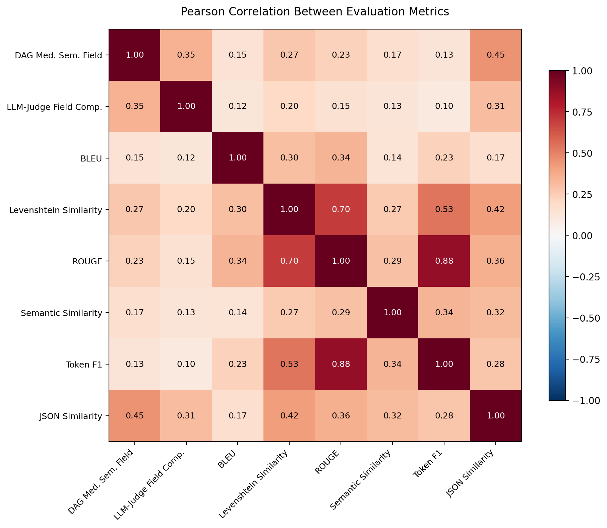

<!-- #R-INTRO — AI-generated (Claude, Feb 2026) — see paper/INSTRUCTIONS.md -->

# Results

This chapter presents the empirical findings of the Zero-Shot evaluation run across all eleven models and 62 test cases from the GraSCCo corpus. Each test case was evaluated using eight metrics spanning statistical, embedding-based, and LLM-as-a-Judge categories. The LLM-as-a-Judge evaluation was performed by GPT-4o-mini (OpenAI).

## Overview

Eleven models were evaluated in a Zero-Shot configuration using the metrics defined in Section 3.6. Tables \ref{tab:avg-scores-stat}–\ref{tab:composite} present the mean scores across all 62 test cases, grouped by metric category. The LLM-as-a-Judge evaluation was performed by GPT-4o-mini (OpenAI).

## Impact of LLM Size

### Aggregate Performance

<!-- #R-TAB-STAT — regenerate from JSON, see INSTRUCTIONS.md -->
The following three tables present the mean scores across all 62 test cases per model, grouped by metric category.

**Statistical Metrics** (deterministic, no model required):

| Model              | Size | BLEU | ROUGE | Levenshtein | Token F1 | JSON Sim. |
|--------------------|------|------|-------|-------------|----------|-----------|
| gemini-2.5-pro | Large | 0.122 | 0.254 | 0.377 | 0.380 | 0.457 |
| gemma3:27b | 27B | 0.080 | 0.210 | 0.343 | 0.309 | 0.362 |
| Kimi-K2.5 | Large | 0.071 | 0.170 | 0.311 | 0.270 | 0.374 |
| gpt-5-nano | Small | 0.085 | 0.201 | 0.318 | 0.313 | 0.335 |
| qwen3.5-35b-a3b | 35B | 0.057 | 0.204 | 0.368 | 0.273 | 0.371 |
| granite3.3:2b | 2B | 0.085 | 0.165 | 0.317 | 0.266 | 0.258 |
| mistral-nemo | 12B | 0.080 | 0.189 | 0.336 | 0.275 | 0.065 |
| glm4:9b | 9B | 0.072 | 0.170 | 0.322 | 0.259 | 0.231 |
| qwen2:7b | 7B | 0.054 | 0.159 | 0.291 | 0.270 | 0.178 |
| phi3.5:3.8b | 3.8B | 0.077 | 0.115 | 0.287 | 0.218 | 0.098 |
| llama3:8b | 8B | 0.077 | 0.160 | 0.314 | 0.245 | 0.129 |

: Mean statistical metric scores per model across 62 test cases (Zero-Shot). {#tab:avg-scores-stat}

The statistical metrics measure whether the model reproduces the exact content and structure of the reference answer. For clinical deployment, these scores indicate how well a model's output could be automatically ingested into a health record system without manual correction. The overall low BLEU scores (0.054–0.122) reflect the expected lexical diversity in clinical text extraction — models express the same medical content using different phrasing. JSON similarity (rightmost column) is the most actionable metric here: a score near zero (e.g. Mistral-Nemo: 0.065) means the output is structurally unparseable.

<!-- #R-TAB-JUDGE — regenerate from JSON, see INSTRUCTIONS.md -->
**Embedding-Based Metric** (requires embedding model) and **LLM-as-a-Judge Metrics** (require generative LLM as evaluator):

| Model              | Size | Sem. Sim. | DAG | LLM-Judge |
|--------------------|------|-----------|-----|-----------|
| gemini-2.5-pro | Large | 0.835 | 0.569 | 0.752 |
| gemma3:27b | 27B | 0.790 | 0.510 | 0.671 |
| Kimi-K2.5 | Large | 0.818 | 0.576 | 0.597 |
| gpt-5-nano | Small | 0.861 | 0.510 | 0.537 |
| qwen3.5-35b-a3b | 35B | 0.829 | 0.505 | 0.513 |
| granite3.3:2b | 2B | 0.843 | 0.407 | 0.415 |
| mistral-nemo | 12B | 0.794 | 0.424 | 0.553 |
| glm4:9b | 9B | 0.732 | 0.425 | 0.466 |
| qwen2:7b | 7B | 0.765 | 0.419 | 0.382 |
| phi3.5:3.8b | 3.8B | 0.795 | 0.356 | 0.481 |
| llama3:8b | 8B | 0.650 | 0.387 | 0.434 |

: Mean embedding and LLM-as-a-Judge scores per model across 62 test cases (Zero-Shot). {#tab:avg-scores-judge}

Semantic similarity (Table \ref{tab:avg-scores-judge}) indicates whether a model captures the medical *meaning* regardless of exact wording. The high scores across most models (0.650–0.861) suggest that even small SLMs comprehend the clinical content. The DAG and LLM-Judge scores assess clinical extraction quality as judged by GPT-4o-mini: the gap between semantic similarity and DAG scores (e.g. Granite 2B: 0.843 vs. 0.407) quantifies the difference between understanding content and producing usable structured output.

<!-- #R-TAB-COMPOSITE — regenerate from JSON, see INSTRUCTIONS.md -->
### Composite Scores by Metric Category

To provide a consolidated view, Table \ref{tab:composite} aggregates the metric averages into three categories and an overall composite score.

| Model              | Size | Statistical | Embedding | LLM-as-a-Judge | Overall | Avg. Latency (ms) |
|--------------------|------|-------------|-----------|----------------|---------|-------------------|
| gemini-2.5-pro | Large (Cloud) | 0.318 | 0.835 | 0.661 | 0.468 | 22'259 |
| gemma3:27b | 27B | 0.261 | 0.790 | 0.590 | 0.409 | 69'136 |
| Kimi-K2.5 | Large (Cloud) | 0.239 | 0.818 | 0.587 | 0.398 | 57'141 |
| gpt-5-nano | Small (Cloud) | 0.250 | 0.861 | 0.524 | 0.395 | 44'443 |
| qwen3.5-35b-a3b | 35B (MoE 3B) | 0.255 | 0.829 | 0.509 | 0.390 | 172'419 |
| granite3.3:2b | 2B | 0.218 | 0.843 | 0.411 | 0.344 | 16'506 |
| mistral-nemo | 12B | 0.189 | 0.794 | 0.488 | 0.339 | 24'556 |
| glm4:9b | 9B | 0.211 | 0.732 | 0.445 | 0.335 | 20'237 |
| qwen2:7b | 7B | 0.191 | 0.765 | 0.400 | 0.315 | 15'730 |
| phi3.5:3.8b | 3.8B | 0.159 | 0.795 | 0.419 | 0.303 | 20'197 |
| llama3:8b | 8B | 0.185 | 0.650 | 0.411 | 0.300 | 17'002 |

: Composite scores (mean of metric averages) by category. Statistical = 5 lexical/structural metrics; Embedding = semantic similarity (text-embedding-3-small); LLM-as-a-Judge = 2 generative evaluation metrics (judged by GPT-4o-mini). {#tab:composite}

The composite score (Table \ref{tab:composite}) provides a consolidated view for clinical deployment viability. An overall score of 0.468 (Gemini 2.5 Pro) represents the current ceiling: a GP using this model would still need to review and correct a substantial portion of extractions. The averaging across metric categories is appropriate here because all three dimensions — lexical fidelity, semantic comprehension, and clinical quality — must be satisfied simultaneously for pipeline integration.

Gemini 2.5 Pro achieves the highest overall composite score (0.468), followed by Gemma3:27b (0.409) and Kimi-K2.5 (0.398). Among the locally executable SLMs, Qwen3.5-35B-A3B — a MoE model with only 3B active parameters — ranks 5th at 0.390, closely matching the cloud models. Granite 3.3 (2B) achieves 0.344, outperforming several models with significantly more parameters.

<!-- #R-TAB-JSON — regenerate from JSON, see INSTRUCTIONS.md -->
## JSON Structural Similarity

A critical finding concerns the models' ability to produce valid, structurally correct JSON output matching the expected schema and the respective content. The `json_similarity_dsp4d_record` metric directly measures this capability.

| Model              | Mean | Std | Min | Max |
|--------------------|------|-----|-----|-----|
| gemini-2.5-pro | 0.457 | 0.092 | 0.298 | 0.783 |
| Kimi-K2.5 | 0.374 | 0.093 | 0.000 | 0.543 |
| qwen3.5-35b-a3b | 0.371 | 0.102 | 0.000 | 0.631 |
| gemma3:27b | 0.362 | 0.070 | 0.177 | 0.521 |
| gpt-5-nano | 0.335 | 0.104 | 0.000 | 0.512 |
| granite3.3:2b | 0.258 | 0.082 | 0.000 | 0.406 |
| glm4:9b | 0.231 | 0.078 | 0.000 | 0.436 |
| qwen2:7b | 0.178 | 0.137 | 0.000 | 0.503 |
| llama3:8b | 0.129 | 0.136 | 0.000 | 0.467 |
| phi3.5:3.8b | 0.098 | 0.130 | 0.000 | 0.362 |
| mistral-nemo | 0.065 | 0.118 | 0.000 | 0.327 |

: JSON similarity distribution per model. {#tab:json-sim}

Gemini 2.5 Pro is the only model with no zero-score cases (min 0.298), producing consistently structured output. Kimi-K2.5 (0.374), Qwen3.5-35B-A3B (0.371), and Gemma3:27b (0.362) also achieve strong mean scores, though each except Gemma3 has occasional zero-score cases. Among the smaller SLMs, Mistral-Nemo (0.065), Phi3.5 (0.098), and Llama3 (0.129) exhibit severe structural compliance issues with high variance.

<!-- #R-CORRELATION — regenerate heatmap from JSON, see INSTRUCTIONS.md -->
## Metric Correlation Analysis

To understand the relationships between evaluation metrics, Figure \ref{fig:metric-correlation} presents the Pearson correlation matrix computed across all model-document interactions (see [Appendix: Pearson Correlation Coefficient](#appendix-pearson) for the mathematical definition).

{#fig:metric-correlation width=85%}

Several patterns emerge from the correlation analysis:

**Strong intra-group correlation among lexical metrics.** Levenshtein similarity, ROUGE, and Token F1 form a tightly correlated cluster (r = 0.53–0.88). This is expected, as all three measure character- or token-level overlap. BLEU correlates moderately with this group (r = 0.23–0.34), likely due to its n-gram precision focus versus the recall-oriented nature of ROUGE and Token F1.

**Low correlation between LLM-as-a-Judge and statistical metrics.** DAG medical semantic field extraction shows weak correlation with the lexical metrics (r = 0.13–0.27), and LLM-Judge field comparison similarly exhibits weak correlations (r = 0.10–0.20). This confirms that the LLM-based evaluators capture a fundamentally different quality dimension — clinical extraction fidelity — that lexical overlap metrics cannot approximate.

**Moderate correlation between LLM-as-a-Judge metrics.** The two judge metrics now show a meaningful positive correlation (r = 0.35), a significant improvement over the previous evaluation run where they were nearly uncorrelated. This suggests that the refined judge prompts (using GPT-4o-mini) achieve better alignment between the DAG-based and direct judge approaches.

**JSON similarity correlates with judge metrics.** JSON similarity shows the highest cross-category correlation with the DAG metric (r = 0.45) and LLM-Judge (r = 0.31), stronger than its correlation with the lexical group (r = 0.17–0.42). This suggests that models producing well-structured JSON also tend to generate clinically more accurate content — format compliance and content quality are not independent.

<!-- END AI-GENERATED CONTENT -->

