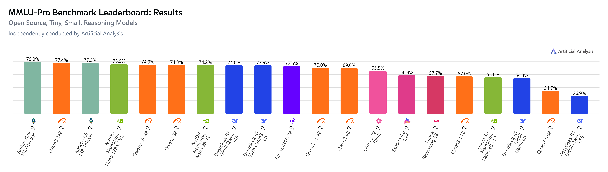

# Appendices
## MMLU-Pro Benchmark Leaderboard

[MMLU-Pro Benchmark Leaderboard (filtered)](https://artificialanalysis.ai/evaluations/mmlu-pro?models=apriel-v1-5-15b-thinker%2Capriel-v1-6-15b-thinker%2Cqwen3-vl-8b-reasoning%2Cdeepseek-r1-qwen3-8b%2Cqwen3-14b-instruct-reasoning%2Cdeepseek-r1-distill-qwen-14b%2Cfalcon-h1r-7b%2Cnvidia-nemotron-nano-12b-v2-vl-reasoning%2Cnvidia-nemotron-nano-9b-v2-reasoning%2Cllama-3-1-nemotron-nano-4b-reasoning%2Cqwen3-4b-instruct-reasoning%2Cqwen3-vl-4b-reasoning%2Cqwen3-8b-instruct-reasoning%2Cdeepseek-r1-distill-llama-8b%2Cjamba-reasoning-3b%2Colmo-3-7b-think%2Cdeepseek-r1-distill-qwen-1-5b%2Cexaone-4-0-1-2b-reasoning%2Cqwen3-1.7b-instruct-reasoning%2Cqwen3-0.6b-instruct-reasoning&model-filters=open-source%2Ctiny-models%2Csmall-models%2Creasoning-models)

Filter: Size Class: Tiny, Small; Open Weights: Open Source; Reasoning: Reasoning; Paramters Count: <=18B
